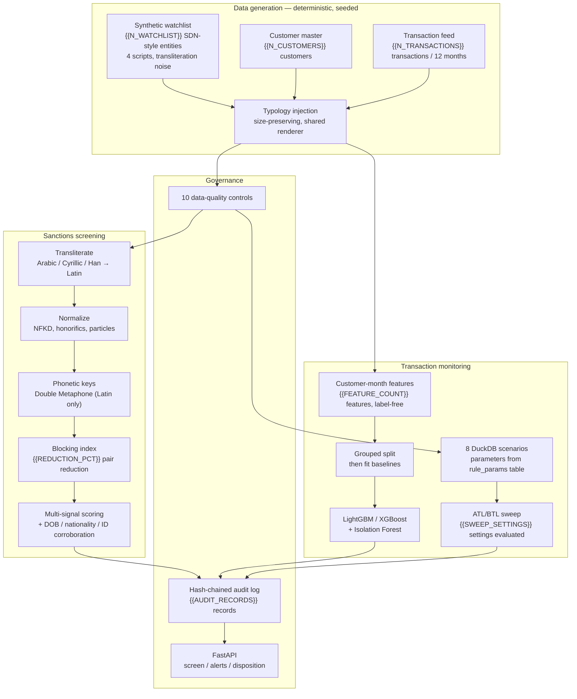

# SentinelScreen

Sanctions screening and AML transaction monitoring, built end to end: synthetic
data generation, a multi-signal name matcher with candidate blocking, eight
parameterised DuckDB scenarios, supervised and unsupervised triage models, an
automated ATL/BTL threshold analyzer, structured audit logging, and a FastAPI
surface.

**Every number and chart below is read from artefacts in `outputs/`, generated
by `make run`.** Nothing in this file is typed by hand — it is assembled by
`src/pipeline/report.py` from the last pipeline run (seed `{{SEED}}`, run id
`{{RUN_ID}}`).

> All data is synthetic. There are no real OFAC/SDN entries anywhere in this
> repository. This is a portfolio project, not legal or compliance advice.
> See [Limitations](#limitations).

---

## The problem

A bank has two obligations that look similar and behave nothing alike.

**Sanctions screening** is a name-matching problem with an asymmetric cost
function. Missing a designated party is a strict-liability breach; the
compensating control is to alert generously, which is why screening teams work
queues with false-positive ratios in the tens to one. The difficulty is not the
string comparison — it is that the same person appears as `Muhammad Al-Hassan`,
`Mohamed Hassan` and `محمد الحسن`, that OFAC publishes a date of birth for only
some entries, and that `Ivanov` and `Ivanova` are the same family and different
people.

**Transaction monitoring** is a ranking problem at roughly 0.4% prevalence where
the label is intent and intent is not in the data. A cash business banking five
deposits of $9,200 and a structurer banking five deposits of $9,200 produce
identical rows. Anything that claims to separate them cleanly is measuring an
artefact.

This repository builds both, and — more importantly — measures both honestly.

---

## Architecture



---

## Headline metrics

| | Result |
|---|---|
| Sanctions screening recall (planted hits) | **{{SCREEN_RECALL}}** ({{SCREEN_DETECTED}} of {{SCREEN_PLANTED}}) |
| Screening false-positive ratio | **{{SCREEN_FP_RATIO}} : 1** at threshold {{SCREEN_THRESHOLD}} |
| Blocking pair-space reduction | **{{REDUCTION_PCT}}** ({{FULL_PAIR_SPACE}} → {{CANDIDATE_PAIRS}} candidate pairs) |
| Blocking recall (planted hits retained) | **{{BLOCKING_RECALL}}** |
| Best triage model | **{{BEST_MODEL}}**, ROC-AUC **{{BEST_AUC}}**, PR-AUC {{BEST_AP}} |
| Model FP ratio at {{BEST_RECALL}} recall | **{{BEST_FP_RATIO}} : 1** — precision {{BEST_PRECISION}} on {{BEST_ALERTS}} alerts |
| Rule-set recall (all 8 scenarios) | **{{RULE_UNION_RECALL}}** |
| Data-quality controls passing | **{{DQ_PASSED}} / {{DQ_CHECKS}}** |
| Reproducibility | byte-identical artefacts across two seeded runs (`make reproduce`) |

---

## Data

Deterministically generated from seed `{{SEED}}`. The same seed produces
byte-identical outputs; this is enforced in CI, not merely asserted.

| | |
|---|---|
| Watchlist entities | {{N_WATCHLIST}} |
| Customers | {{N_CUSTOMERS}} |
| Transactions | {{N_TRANSACTIONS}} |
| Scored customer-months | {{N_CELLS}} |
| True anomaly cells | {{ANOMALY_CELLS}} ({{ANOMALY_RATE}}) |
| Near-miss cells | {{NEAR_MISS_CELLS}} ({{NEAR_MISS_RATE}}) |
| Positives with no observable typology | {{INVISIBLE_ANOMALIES}} |

The unit of analysis for monitoring is the **customer-month with at least one
transaction**, because that is what an alert queue is actually drawn from.

### Entity relationships

```mermaid
{{ERD}}
```

Ground truth lives in its own `labels` table so that it is structurally
impossible for a feature query to pick up the target with `SELECT *`.

### Why the data is hard on purpose

An early version of this generator produced a dataset on which LightGBM scored
**0.996 ROC-AUC** — and an Isolation Forest, which never sees a label, scored
**0.979**. That second number is the tell: a label-blind model can only separate
the classes if the positives are outliers in raw feature space. The generator,
not the model, was doing the work.

The cause was additive injection: anomalous cells were handed extra
transactions, so "is anomalous" collapsed into "is unusually busy". Three
changes fixed it, each mirroring a property of the real problem:

1. **Injection is size-preserving.** A typology *replaces* a share of the
   customer-month's existing transactions. A laundering month has roughly the
   transaction count the account always had; what changes is their shape.
2. **True typologies and legitimate look-alikes share one renderer.** The
   populations differ only in pattern mix and in an intensity multiplier whose
   distributions overlap.
3. **Some positives are rendered as nothing.** {{INVISIBLE_ANOMALIES}} labelled
   positives carry no observable typology, which puts a real ceiling on recall.

The claim is shipped as evidence, not prose. `outputs/separability_diagnostics.json`
decomposes where the model's discrimination actually comes from:

| Measurement | Value | Reading |
|---|---|---|
| Anomaly vs. near miss (within injected cells) | **{{NEAR_MISS_AUC}}** | {{NEAR_MISS_VERDICT}} — the two populations are drawn from one renderer |
| Injected vs. ordinary cells | {{INJECTED_AUC}} | legitimate signal: a typology should not look like a salary account |
| Mean score percentile, invisible positives | {{INVISIBLE_PCTL}} | mid-pack, as a positive carrying no observable pattern must be |
| Mean score percentile, near-miss cells | {{NEAR_MISS_PCTL}} | ranked alongside true anomalies, which is why precision stays low |

The first row is the one to read. Anything materially above 0.50 there would mean
every precision figure below is an artefact of the generator.

---

## Sanctions screening

### Pipeline order is load-bearing

```
raw name → transliterate → normalize → phonetic key → block → score
```

Transliteration must come first. Double Metaphone encodes *English*
orthography; applied to `Иванов` it walks the string looking for English
digraphs, finds none, and returns a key derived from nothing. That is not an
error — it is a plausible-looking wrong answer that silently drops every
non-Latin name out of its block. `src/sanctions/phonetics.py` raises on
non-Latin input rather than allowing it.

Arabic makes the point sharply. It is an abjad: short vowels are not written. A
naive codepoint map turns `محمد` into the consonant skeleton `mhmd`, whose
Double Metaphone key is `MMT`, while every conventional romanization
(Mohammed / Muhammad / Mohamed) keys to `MHMT`. The skeleton would be blocked
*away* from the names it should match. Arabic therefore goes through a name
lexicon first, and only falls back to the character table for unknown tokens.

### Blocking

Screening {{N_CUSTOMERS}} customers against {{REFERENCE_NAMES}} reference names
— {{N_WATCHLIST}} entities plus every a.k.a. they carry, since the alias is
frequently the form a payment message actually contains — is
{{FULL_PAIR_SPACE}} pairs. Blocking indexes those names under keys that any true
variant of them would also produce.

| | |
|---|---|
| Reference names indexed | {{REFERENCE_NAMES}} ({{ALIAS_NAMES}} of them aliases) |
| Full pair space | {{FULL_PAIR_SPACE}} |
| Candidate pairs after blocking | {{CANDIDATE_PAIRS}} |
| **Reduction** | **{{REDUCTION_PCT}}** |
| Mean candidates per subject | {{MEAN_CANDIDATES}} |
| Largest block | {{LARGEST_BLOCK}} |
| Fully scored pairs (after cascade) | {{SCORED_PAIRS}} |
| **Blocking recall on planted hits** | **{{BLOCKING_RECALL}}** |

The recall figure is reported next to the reduction figure deliberately: either
alone is meaningless, because a blocker that returns nothing achieves 100%
reduction. Blocks exceeding the size cap are *split* on a refinement character
rather than dropped, so common surnames stay screenable.

### Screening results

At the production threshold of {{SCREEN_THRESHOLD}}:

| | |
|---|---|
| Planted true matches | {{SCREEN_PLANTED}} |
| Detected | {{SCREEN_DETECTED}} (**recall {{SCREEN_RECALL}}**) |
| Customers alerted | {{SCREEN_ALERTED}} ({{SCREEN_ALERT_RATE}} of portfolio) |
| Precision | {{SCREEN_PRECISION}} |
| False-positive ratio | {{SCREEN_FP_RATIO}} : 1 |
| Planted near misses alerted | {{NEAR_MISS_ALERTED}} of {{NEAR_MISS_PLANTED}} |


Corroboration can de-prioritise a hit; it never auto-clears one. An exact name
match against a designated party stays in the analyst queue even when the date
of birth disagrees, because stale KYC data is a far more common explanation than
coincidence at that name score.

---

## Transaction monitoring

Eight scenarios, all parameterised from a `rule_params` table that the SQL joins
against. No threshold is interpolated into a query string — that is what lets
the ATL/BTL analyzer re-execute the *same* SQL under different parameters and
produce evidence that describes production rather than a reimplementation.

| Scenario | Alerts | Precision | Recall | FP ratio |
|---|---|---|---|---|
{{RULE_TABLE}}

Union recall across all eight scenarios: **{{RULE_UNION_RECALL}}**, on
{{RULE_ALERT_ROWS}} alert rows.


---

## Models

### Split discipline

Features are built from the transaction feed alone; the label table is joined
only after the split.

1. Build label-free base features ({{FEATURE_COUNT}} features).
2. **Split by `customer_id`** — grouped, so no customer appears on both sides.
3. Fit peer baselines and shrinkage targets on the **training customers only**.
4. Transform both sides with those fitted statistics.
5. Only now attach labels.

A random row split would put January and February of the same customer on
opposite sides; behaviour is highly autocorrelated, so the model would be
scoring accounts it had memorised. Fitting the peer median over the full dataset
would let test-period behaviour influence the baseline a test cell is compared
against — a subtle leak worth several points of ROC-AUC.

| | |
|---|---|
| Train | {{TRAIN_ROWS}} rows / {{TRAIN_CUSTOMERS}} customers |
| Test | {{TEST_ROWS}} rows / {{TEST_CUSTOMERS}} customers |

**The test set is never resampled.** Every figure below is at the natural class
balance. A precision computed after balancing the test set is not a precision —
it describes a population that does not exist.

### Results

| Model | ROC-AUC | PR-AUC | Recall | Precision | Alerts | FP ratio |
|---|---|---|---|---|---|---|
{{MODEL_TABLE}}

Out-of-time check (trailing months of the held-out customers): ROC-AUC
{{OOT_AUC}} on {{OOT_N}} rows. The grouped split answers "does this generalise
to unseen customers"; the out-of-time slice answers "does it still work next
quarter", which is where monitoring models degrade first.


### Leakage tripwires

Training **raises** rather than returning a model that trips either ceiling.

- **Supervised ceiling: {{LEAKAGE_CEILING}}.** Deliberately not 0.90. At 0.4%
  prevalence the ROC geometry forces it: reaching 85% recall at a 25:1 review
  ratio means operating at roughly 8.5% false-positive rate, and the area under
  *any* curve through (0.085, 0.85) is at least 0.88. A 0.90 hard ceiling would
  flag correct behaviour as a defect. The two targets — "≤0.90 AUC" and "10:1 to
  25:1 at 85%+ recall" — are in tension by construction, and this repository
  resolves it toward the operationally meaningful one while stating the
  arithmetic rather than quietly picking a side.
- **Unsupervised ceiling: {{UNSUP_CEILING}} on the Isolation Forest**, which
  scores {{UNSUP_AUC}} here. This is the sharper test and the one that caught a
  real bug during development. A label-blind model that separates the classes
  well proves the positives are raw-space outliers, which means the generator is
  doing the model's work.

The false-positive ratio the brief targets (10:1 to 25:1) is achieved at the
fixed 5% alert-budget operating point, which is how a monitoring queue is
actually sized — by analyst headcount, not by a recall target. Both operating
points are reported in `outputs/model_metrics.json`.

---

## ATL/BTL threshold analysis

Above-the-line testing asks what the current threshold's alerts are worth.
Below-the-line testing asks the harder question: what did the threshold let
through, and what would catching it cost?

{{SWEEP_SETTINGS}} settings evaluated across 8 rules, against a baseline that
produces {{BASELINE_ALERTS}} alerts in total. Example — `R01_STRUCTURING`
sweeping `min_txn_count`:

| Threshold | Position | Precision | Recall | Alert volume | FP ratio |
|---|---|---|---|---|---|
{{SWEEP_TABLE}}

The column a tuning committee actually decides on is
`marginal_reviews_per_extra_hit` in `outputs/atl_btl_sweep.csv`: relaxing a
threshold always finds more, and the only question is what each additional
confirmed hit costs in analyst time.

| Rule | Parameter | Baseline | Recommended | Alerts base | Alerts rec. | Recall base | Recall rec. | Cheapest relaxation, reviews per extra hit |
|---|---|---|---|---|---|---|---|---|
{{RECOMMENDATION_TABLE}}

A recommendation equal to the baseline is a result, not a no-op: it means every
looser setting costs more analyst time per additional confirmed hit than the
configured review budget allows. The last column is the evidence — where it
reads in the hundreds, relaxing that threshold buys a handful of extra hits for
several hundred extra reviews each, and the committee's answer is no.


These recommendations are a decision *aid*, not a decision. A real tuning
committee weighs typology coverage, regulatory expectation and analyst capacity;
the point of surfacing them is that the basis is reproducible and visible.

---

## Governance

### Data quality

Ten controls, defined as SQL in `config/dq_checks.yaml` rather than in Python —
a control set is signed off by people who read SQL. BLOCKER failures abort the
pipeline, because continuing would produce artefacts that look authoritative and
are not.

| Check | Dimension | Severity | Status | Failing rows |
|---|---|---|---|---|
{{DQ_TABLE}}

### Audit

{{AUDIT_RECORDS}} immutable records, chained by hash (head
`{{AUDIT_HEAD}}…`). Each carries the rule version, an input *snapshot* rather
than a foreign key — the customer row will have changed by the time anyone asks
— and the exact scoring breakdown. Each record commits to its predecessor, so
editing one invalidates every record after it and `AuditLog.verify()` reports
where the chain broke.

No `print()` statements anywhere in the codebase; everything goes through
`logging`, with a JSON-lines file sink.

### API

```
POST /screen/name                  real-time name screening
POST /screen/transaction           counterparty screening + single-txn flags
GET  /alerts                       the analyst queue, ranked by score
POST /alerts/{id}/disposition      disposition, written to the audit chain
```

An L1 analyst cannot close an `ESCALATE`-band sanctions match; that is an L2
action, enforced in `src/api/service.py` and returned as a 403.

---

## Reproducibility

```bash
make install     # pinned dependencies
make run         # regenerate everything from a cold start
make test        # pytest suite
make reproduce   # run twice, diff every artefact
make readme      # regenerate this file from outputs/
make api         # uvicorn on :8000
```

Determinism is engineered, not hoped for: one seeded `numpy.random.Generator`
threaded through every draw, DuckDB pinned to a single thread (parallel
aggregation reorders floating-point sums), LightGBM in `deterministic` +
`force_row_wise` mode, fixed float formatting and pinned line endings on every
artefact, and a run id derived from the seed rather than a UUID.

The contract covers **results, not speed**. Wall-clock durations are the one
thing two identical runs may legitimately disagree on, so every timing —
blocking build and probe, per-control data-quality latency, per-scenario runtime
— is funnelled into `outputs/run_timings.json`, which the diff excludes. That
separation was not a design instinct; the check caught four artefacts differing
only in their trailing duration column, with every result column byte-identical.

`make reproduce` runs the pipeline twice from a cold start, regenerating the
dataset from the seed each time, and hashes {{ARTEFACT_COUNT}} artefacts. Any
difference fails the build. CI runs it on every push.

---

## Limitations

Read this section before drawing any conclusion from the numbers above.

- **The data is entirely synthetic.** There are no real OFAC, SDN, UN or EU
  entries in this repository. The watchlist is generated from a name corpus and
  the "programs" are labels, not designations. Performance on synthetic data
  with a known generator is an upper bound on, not an estimate of, performance
  on a real list.
- **The synthetic name space is compressed.** A real SDN list spans far more
  distinct surnames than this corpus does, so coincidental name collisions occur
  at a higher rate here than in production. The screening alert rate is
  correspondingly inflated.
- **Fuzzy and phonetic matching carry irreducible error.** Double Metaphone is
  tuned for English; cross-romanization matching between Hanyu Pinyin,
  Wade-Giles and Cantonese forms (`Zhang` / `Chang` / `Cheung`) is the largest
  remaining source of false negatives here, and closing it needs a curated
  equivalence table that was deliberately *not* sourced from the generator —
  doing so would have made the evaluation circular.
- **A production system requires human review.** Nothing here may auto-clear or
  auto-block on model score alone. The three-band disposition assumes a Level 1
  analyst queue and a Level 2 sanctions officer above it. The models rank a
  queue; they do not decide.
- **The ATL/BTL thresholds are illustrative.** In production they would be
  governed under a model risk management framework, periodically re-tuned,
  independently validated, and documented with the typology coverage rationale
  that a supervisor expects.
- **Metrics are noisy at this prevalence.** The held-out set contains a few
  hundred positives; precision and recall carry confidence intervals of several
  points and should be read as ranges, not point estimates.
- **This is a portfolio project. It is not legal or compliance advice**, and it
  is not a substitute for a sanctions compliance programme.

---

## Layout

```
sentinelscreen/
├── config/          rules, thresholds, seeds, DQ controls  (YAML — reviewable)
├── src/
│   ├── data/        generator, typology injection, schemas, validation, DuckDB
│   ├── sanctions/   transliteration → normalization → phonetics → blocking → scoring
│   ├── monitoring/  DuckDB scenarios, features, models, ATL/BTL
│   ├── pipeline/    orchestration, audit chain, data quality, reporting
│   └── api/         FastAPI routes and service layer
├── scripts/         CLI entry points: run_pipeline, reproduce, render_readme
├── tests/           unit, integration, determinism
├── outputs/         every artefact this README reads from
└── docs/            README template
```
